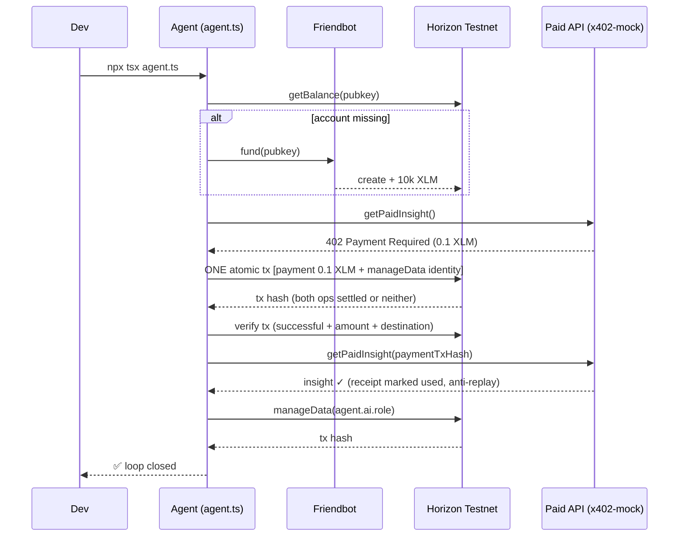

# tiny-onchain-agent-template

[](https://developers.stellar.org/docs/learn/fundamentals/networks)
[](https://www.typescriptlang.org/)
[](./LICENSE)

## Live proof (testnet, verify it yourself)

- Atomic tx (fee + identity): https://stellar.expert/explorer/testnet/tx/2a97b1b18435e65d8d7afe3aae78a89b8e7588d49aa3a89ff3d0ef1705d35f50
- Account: https://stellar.expert/explorer/testnet/account/GBURYG65LVDMC3M34Z4YMGDIOVXATCBALGWKK5TXFHOKS5HSWIQVP765

Every run prints its own explorer links — click any of them, no trust needed.

Tiny **Observe → Reason → Act** agent on **Stellar testnet**. A 101 template — no Soroban, no Docker, no wallet extension. One command, free testnet XLM.

Inspired by _A Developer's Guide to Building on the Onchain AI Agent Stack_, adapted from EVM → Stellar.

| EVM stack            | Stellar mapping (this repo)                   |
| -------------------- | --------------------------------------------- |
| Access RPC           | Horizon Testnet API                           |
| ERC-8004 identity    | Stellar account + data entry                  |
| x402 pay-per-request | Same 402 flow, mocked, settled in testnet XLM |
| Swap execution       | Native XLM payment                            |

## How it works

```
Observe (Horizon: balance) → Reason (x402: need insight?) → Act (ONE atomic tx: pay fee + write identity)
```



## Quickstart

```bash
git clone https://github.com/gonzalezlrjesus/tiny-onchain-agent-template.git
cd tiny-onchain-agent-template
npm install
cp .env.example .env
# optional: put your SECRET_KEY in .env (testnet only!)
# generate one: npx tsx -e "import {Keypair} from '@stellar/stellar-sdk'; console.log(Keypair.random().secret())"
npx tsx agent.ts
# preview without writes:
npx tsx agent.ts --dry-run
# offline unit + property tests:
npm test
```

## Quality gates

```bash
npm run format:check  # prettier  (rustfmt)
npm run lint          # eslint strict + sonar + import-x, complexity ≤8, no magic numbers  (clippy pedantic)
npm run typecheck     # tsc + noUnusedLocals  (cargo check + machete)
npm test              # unit + property + pairwise + fuzz, deterministic  (proptest)
npm run mutate        # stryker mutation, break 80 on pure units  (cargo-fuzz mindset)
npm run audit         # 0 vulns  (cargo audit)
npm run duplicates    # jscpd, 0 clones in source
```

No `SECRET_KEY`? The agent runs with an ephemeral in-memory identity (secret never logged) and auto-funds via Friendbot — still 1 command. To keep the same identity, generate one and save it to `.env`.

## Files

| File                 | What                                                                          |
| -------------------- | ----------------------------------------------------------------------------- |
| `agent.ts`           | The loop: Observe → Reason → Act                                              |
| `rpc.ts`             | Horizon I/O shell: retry, atomic acts, receipt verification (freshness+fee)   |
| `validate.ts`        | Pure validation + stroop math + timestamp freshness (mutation-tested)         |
| `config.ts`          | Network constants, single source (testnet bounding)                           |
| `x402-mock.ts`       | 402 flow with real Horizon verification + one-time receipts (anti-replay)     |
| `errors.ts`          | Typed errors with exit codes + documented numeric codes (1000–3402)           |
| `audit.ts`           | Accounting log: one JSON line per run to `ledger-log.jsonl` (never committed) |
| `validation.test.ts` | Offline unit + property + fuzz tests (`npm test`)                             |
| `pairwise.test.ts`   | All-pairs validation matrix (`npm test`)                                      |
| `AGENTS.md`          | Working agreement for humans + coding agents (skills included)                |
| `identity.json`      | Onchain identity v1 (fill `publicKey` after first run)                        |

## Example output

```
🤖 tiny-onchain-agent-template (Stellar testnet) — Observe > Reason > Act

👁️  OBSERVE: checking balance on Horizon testnet…
   Balance: 9999.99998 XLM

🧠 REASON: requesting paid insight (x402 mock)…
   💳 402 Payment Required: 0.1 XLM testnet
⚡ ACT (1/2): paying x402 fee (native XLM payment)…
   Tx: https://stellar.expert/explorer/testnet/tx/abc…
   Insight: "Testnet is calm: fees ~100 stroops, ledger closes ~5s. Good time to act."

⚡ ACT (2/2): writing identity data entry…
   Tx: https://stellar.expert/explorer/testnet/tx/def…

✅ Done. GABC… holds 9999.89996 XLM. Loop closed: Observe > Reason > Act.
```

Built with `stellar-sdk` + Horizon + Friendbot. MIT.
